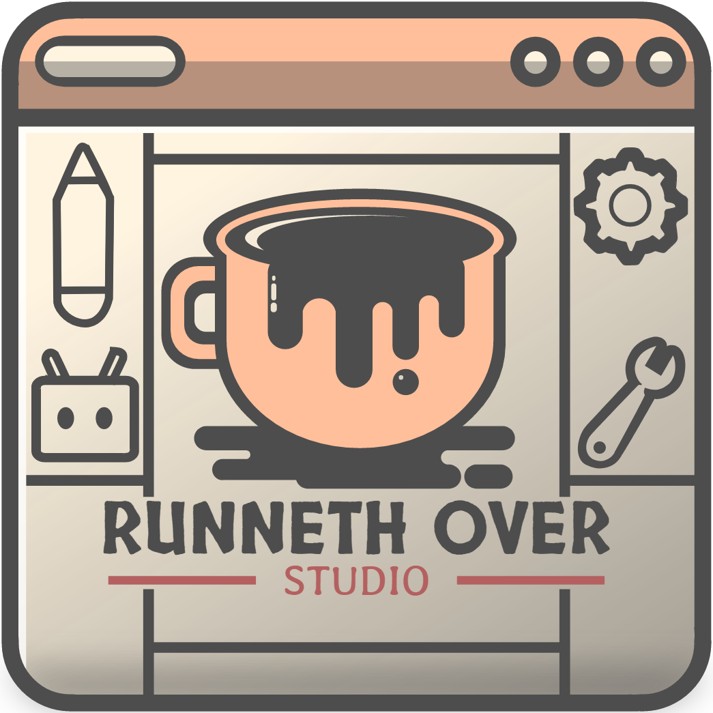

<p align="left">
  
</p>

# App Toolkit
Runneth Over Studio common C# app development code.

## Versioning
Gopher Wood Engine uses [Semantic Versioning](https://semver.org/).

- **MAJOR** version: Incompatible API changes
- **MINOR** version: Backward-compatible functionality
- **PATCH** version: Backward-compatible bug fixes

## Build Requirements
- All projects target the LTS version of the [.NET SDK](https://dotnet.microsoft.com/en-us/download).
- The Build project uses [Cake](https://cakebuild.net/) (C# Make) as the build orchestrator and can be launched from your IDE or via script.

	- On OSX/Linux run:
	```bash
	./build.sh
	```
	- If you get a "Permission denied" error, you may need to make the script executable first:
	```bash
	chmod +x build.sh
	```

	- On Windows PowerShell run:
	```powershell
	./build.ps1
	```
